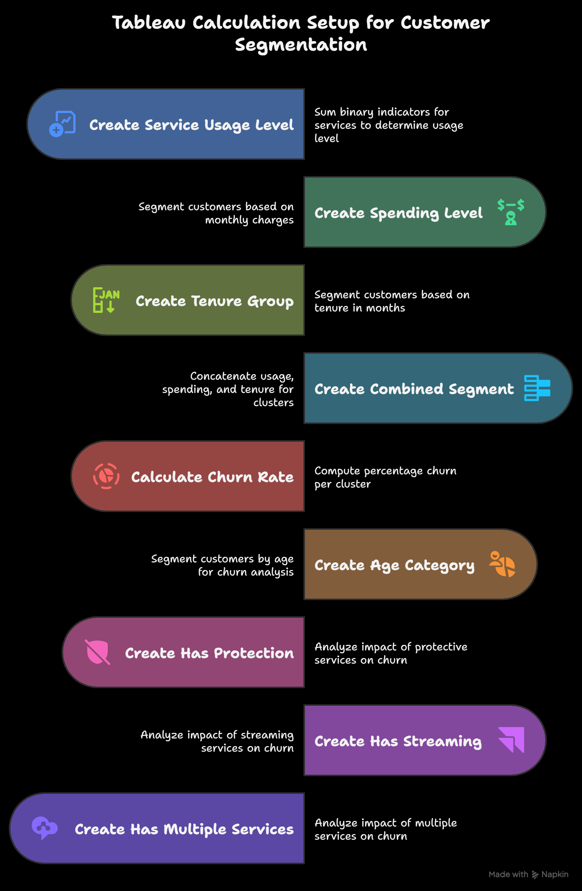
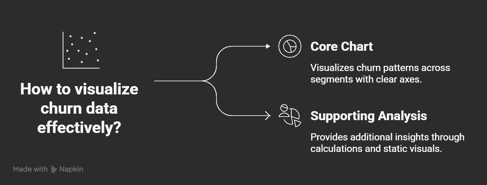
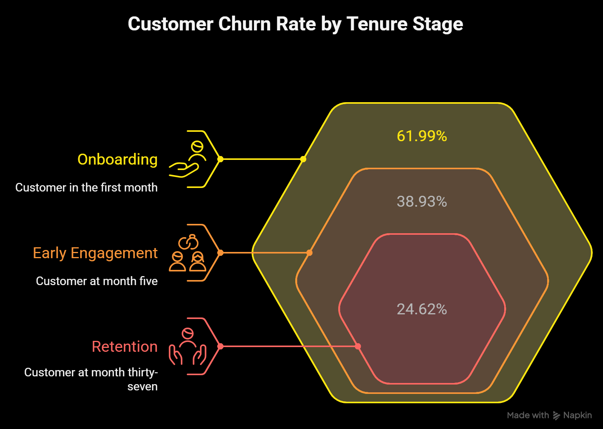
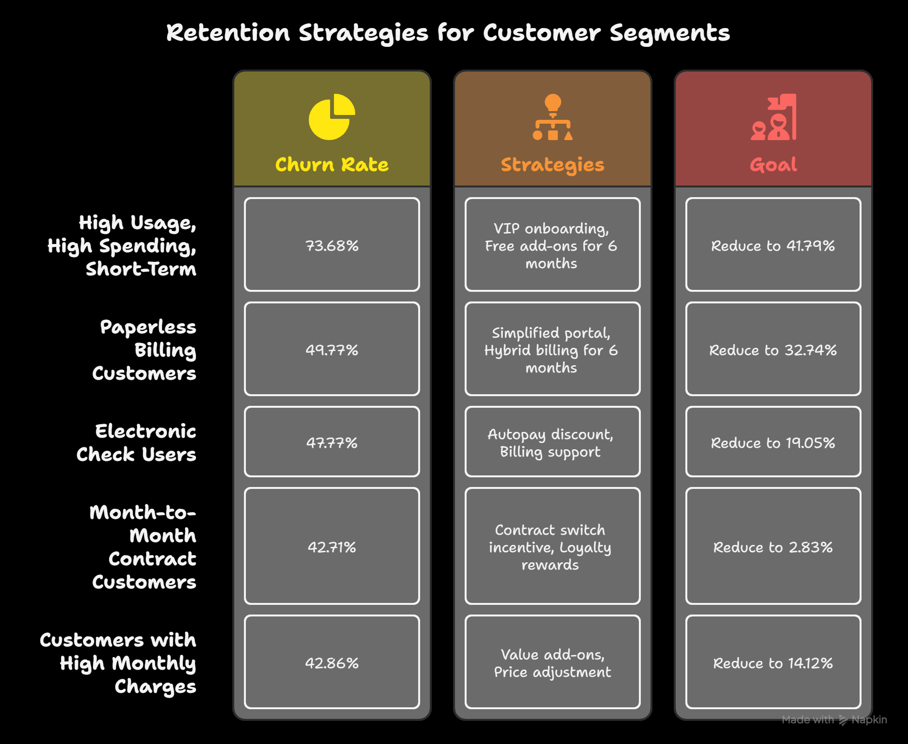

# Customer-Segmentation-and-Churn-Analysis-in-Tableau
A Tableau-based workflow for customer segmentation and churn analysis using rule-based clustering, visualizations, insights, and retention strategies to reduce customer attrition in telecom.

# Customer Segmentation and Churn Analysis in Tableau

## Overview

This repository documents a comprehensive workflow for performing customer segmentation and churn analysis using Tableau. The project focuses on rule-based clustering (no machine learning) to segment customers based on traits like service usage, spending, and tenure. It includes calculated fields for segmentation, churn rate analysis, static visualizations, key insights into churn drivers, and actionable retention strategies. The goal is to identify high-risk customer segments and propose targeted interventions to reduce churn.

The workflow is derived from telecom customer data (assuming fields like Customer ID, Tenure, Monthly Charges, Churn, etc.) and is divided into five phases for clarity and reproducibility.

## Table of Contents

- [Overview](#overview)
- [Prerequisites](#prerequisites)
- [Project Workflow](#project-workflow)
  - [Phase 1: Calculation Setup](#phase-1-calculation-setup-for-segmentation-and-clustering)
  - [Phase 2: Visualization Setup](#phase-2-visualization-setup)
  - [Phase 3: Insight Derivation](#phase-3-insight-derivation)
  - [Phase 4: Recommendations and Retention Strategies](#phase-4-recommendations-and-retention-strategies)
  - [Phase 5: Next Steps](#phase-5-next-steps)
- [Screenshots](#screenshots)
- [Data Assumptions](#data-assumptions)
- [How to Use](#how-to-use)
- [Contributing](#contributing)
- [License](#license)

## Prerequisites

- Tableau Desktop or Tableau Public (version 2020+ recommended).
- Sample dataset: Use a telecom customer dataset 
- No external libraries or installations required—everything is done via Tableau's calculated fields.

## Project Workflow

### Phase 1: Calculation Setup for Segmentation and Clustering

Create the following calculated fields in Tableau in dependency order:

1. **Service Usage Level**:
   - Calculation: Sum of binary indicators for services (e.g., IF [Phone Service] = 'Yes' THEN 1 ELSE 0 END + IF [Multiple Lines] = 'Yes' THEN 1 ELSE 0 END + ... for all services).
   - Thresholds: IF total >= 5 THEN 'High Usage' ELSEIF total >= 2 THEN 'Medium Usage' ELSE 'Low Usage' END.
   - Purpose: Counts active services to determine usage level.

2. **Spending Level**:
   - Calculation: IF [Monthly Charges] > 80 THEN 'High Spending' ELSEIF [Monthly Charges] > 50 THEN 'Medium Spending' ELSE 'Low Spending' END.
   - Purpose: Segments by monthly spending.

3. **Tenure Group**:
   - Calculation: IF [Tenure] > 36 THEN 'Long-Term' ELSEIF [Tenure] > 12 THEN 'Medium-Term' ELSE 'Short-Term' END.
   - Purpose: Segments by customer tenure in months.

4. **Combined Segment**:
   - Calculation: [Service Usage Level] + '|' + [Spending Level] + '|' + [Tenure Group] (e.g., 'High Usage|High Spending|Short-Term').
   - Purpose: Concatenates segments to form clusters.

5. **Additional Calculations**:
   - **Churn Rate**: SUM(IF [Churn] = 'Yes' THEN 1 ELSE 0 END) / COUNT([Customer ID]) * 100.
   - **Age Category**: IF [Senior Citizen] = 0 THEN 'NON-SENIOR CITIZEN' ELSE 'SENIOR CITIZEN' END.
   - **Has Protection**: IF [Online Security] = 'Yes' OR [Online Backup] = 'Yes' OR [Device Protection] = 'Yes' THEN 'Yes' ELSE 'No' END.
   - **Has Streaming**: IF [Streaming TV] = 'Yes' OR [Streaming Movies] = 'Yes' THEN 'Yes' ELSE 'No' END.
   - **Has Multiple Services**: IF [Internet Service] != 'No' AND [Phone Service] = 'Yes' THEN 'Yes' ELSE 'No' END.

### Phase 2: Visualization Setup

1. **Core Chart: Top N Clusters with High Churn Rate**:
   - Y-Axis: Combined Segment.
   - X-Axis: Churn Rate.
   - Purpose: Bar chart to visualize churn patterns across segments.

2. **Supporting Analysis**:
   - Group by additional fields (e.g., Age Category, Has Protection) for breakdowns.
   - Use static visuals like bar charts or heatmaps for simplicity.

### Phase 3: Insight Derivation

1. **Churn Rates Across Segments**:
   - Highest-Risk: High Usage, High Spending, Short-Term at 73.68%.
   - Other High-Risk: Paperless Billing at 49.77%; Electronic Check at 47.77%; Month-to-Month Contracts at 42.71%; High Monthly Charges ($90–$100) at 42.86%.
   - Usage Levels: Medium Usage at 37.38%; High Usage at 23.58%; Low Usage at 10.92%.
   - Tenure Stages: Onboarding (0–1 month) at 61.99%; Early Engagement (2–20 months) peaks at 38.93% (month 5); Retention (21–40 months) peaks at 24.62% (month 37); Loyalty (41+ months) with 40.91% retention.
   - Billing and Payment: Paperless at 49.77% vs. 32.74% without; Electronic Check at 47.77% vs. 19.05% for credit card (automatic).
   - Service Factors: No protection at 52.55% vs. 24.03% with; No tech support at 41.64% vs. 15.17% with; High spenders at 33.98% vs. 15.70% for low spenders.

2. **Key Drivers of Churn**:
   - Early tenure (first month at 61.99%, dropping to 38.93% by month 5).
   - Billing issues (manual payments like electronic check; paperless billing).
   - Service reliability (lack of protection and tech support).
   - Value perception (high spenders and high monthly charges).
   - Contract type (Month-to-Month at 42.71% vs. 2.83% for two-year).

### Phase 4: Recommendations and Retention Strategies

1. **Actionable Recommendations**:
   - Focus on Early Engagement: Structured onboarding (welcome calls, tutorials, free add-ons for 3 months).
   - Promote Autopay: Discounts for switching from electronic check to automatic payments.
   - Encourage Protection/Tech Support: 3-month free trial.
   - Address High Spenders: Value add-ons (e.g., free streaming) for charges above $90.

2. **Personalized Retention Strategies for Top 5 Segments**:

| Segment | Churn Rate | Strategies | Goal |
|---------|------------|------------|------|
| High Usage, High Spending, Short-Term | 73.68% | - VIP onboarding - Free add-ons for 6 months | Reduce to 41.79% |
| Paperless Billing Customers | 49.77% | - Simplified portal - Hybrid billing for 6 months | Reduce to 32.74% |
| Electronic Check Users | 47.77% | - Autopay discount - Billing support | Reduce to 19.05% |
| Month-to-Month Contract Customers | 42.71% | - Contract switch incentive - Loyalty rewards | Reduce to 2.83% |
| Customers with High Monthly Charges ($90–$100) | 42.86% | - Value add-ons - Price adjustment | Reduce to 14.12% |

### Phase 5: Next Steps

1. **Implementation Timeline**: Start with onboarding improvements and autopay promotion by Q1 2025.
2. **Monitoring**: Track churn rates monthly, aiming for a 15% overall reduction.
3. **Focus Areas**: Prioritize early engagement (first 5 months) and billing improvements for electronic check users.

## Screenshots

Below are key visuals from the project workflow:

- **Calculation Setup Overview**:
  

- **Visualization Flow**:
  

- **Churn by Tenure Stage**:
  

- **Retention Strategies**:
  

## Data Assumptions

- Assumes a clean dataset with no missing values in key fields.
- Churn is binary ('Yes'/'No').
- Adapt calculations if field names differ.

## How to Use

1. Load your dataset into Tableau.
2. Create the calculated fields as described in Phase 1.
3. Build visualizations per Phase 2.
4. Analyze insights and apply recommendations.
5. Export dashboards or share via Tableau Public.

For a sample Tableau workbook, see `customer-churn-analysis.twbx` in this repo (if provided).

## Contributing

Contributions are welcome! Please fork the repo and submit a pull request with improvements, such as additional visualizations or dataset examples.

## License

This project is licensed under the MIT License - see the [LICENSE](LICENSE) file for details.

## Crafted with care by Gajarajan V Y — Data Analyst & Insight Architect
